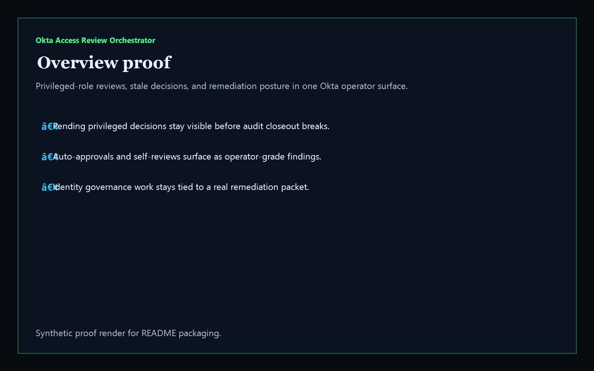
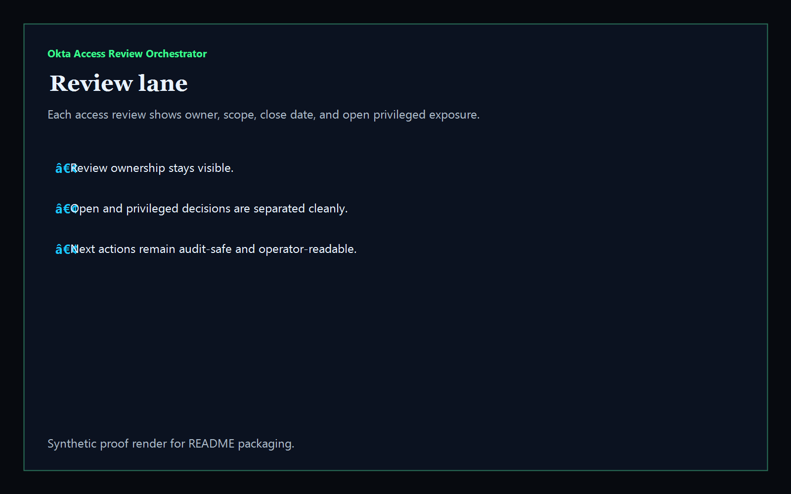
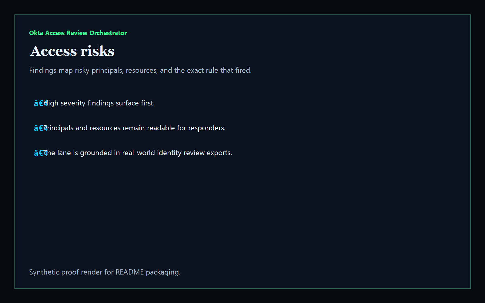
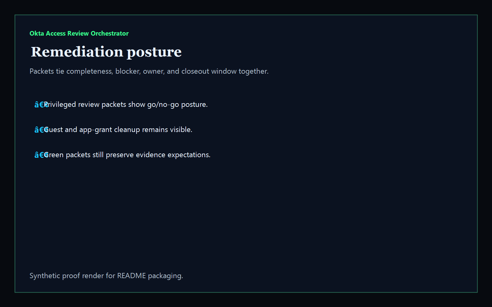

# Okta Access Review Orchestrator

[](https://github.com/mizcausevic-dev/okta-access-review-orchestrator/actions/workflows/ci.yml)
[](./LICENSE)
[](https://github.com/mizcausevic-dev/okta-access-review-orchestrator/actions/workflows/pages.yml)

Operator control plane for Okta access reviews, admin-role decisions, stale attestations, and identity-governance remediation posture.

## Why this exists

- Enterprise teams need more than a raw review export when audits, access campaigns, and remediation timing collide.
- Identity operators need one surface that shows admin-role exposure, self-approval risk, stale application gaps, and reviewer closeout posture.
- Recruiters and buyers looking for `Okta / IAM / access governance / SSO` proof should see an operator dashboard, not an identity tutorial.
- Access-review operations become more valuable when they are packaged as an auditable control plane for security, platform, and IT teams.

## Why this matters (KG Embedded tie-back)

This repo demonstrates the identity-governance control-plane primitive for Okta tenant operations: access reviews, admin-role risk, stale app-assignment posture, and buyer-readable remediation packets in one operator surface. Kinetic Gain Embedded extends this pattern into productized in-app dashboards where security, audit, and platform signals need to be visible without exposing unsafe write paths or tenant secrets. See [kineticgain.com/embedded](https://kineticgain.com/embedded).

## What it shows

- review-lane visibility for access campaigns and ownership
- admin-role risk detection across privileged assignments
- remediation packets for dormant approvals, self-reviewed decisions, and stale app-assignment closeout
- offline-safe analysis of captured review exports
- recruiter-facing Okta governance proof that composes cleanly with Defender, Apple device-trust, and broader cloud-security lanes

## Routes

- `/`
- `/review-lane`
- `/access-risks`
- `/remediation-posture`
- `/verification`
- `/docs`

## API

- `/api/dashboard/summary`
- `/api/review-lane`
- `/api/access-risks`
- `/api/remediation-posture`
- `/api/verification`
- `/api/sample`

## Screenshots






## CLI

```powershell
npx okta-access-review fixtures/reviews.json `
    --format summary `
    --now 2026-05-29T00:00:00Z `
    --overdue-after-days 14 `
    --stale-after-days 30
```

## Local Development

```powershell
cd okta-access-review-orchestrator
npm install
npm run dev
```

## Validation

- `npm run verify`
- `npm run prerender`
- `npm run render:assets`

## Production status

| Aspect | Status |
|--------|--------|
| Deploy | Static prerender -> **https://okta.kineticgain.com/** |
| Data posture | Synthetic sample data only; no tenant identifiers, tokens, or live exports are committed |

## Docs

- [Architecture](./docs/architecture.md)
- [Origin](./docs/ORIGIN.md)
- [Kinetic Gain Embedded tie-back](./docs/KINETIC_GAIN_EMBEDDED.md)
- [Changelog](./CHANGELOG.md)
